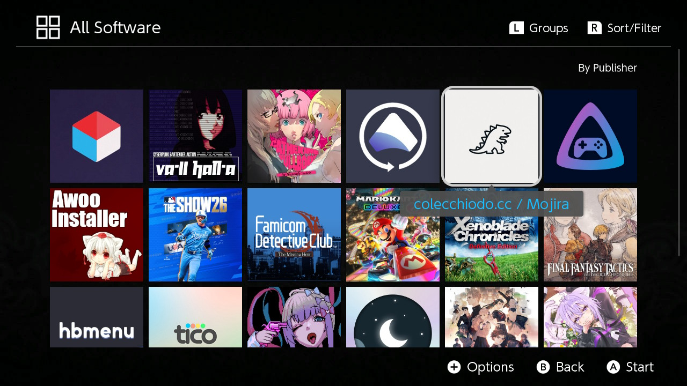

# Mojira-nx -「モジラ」 Sentence Mining Switch Client

**Mojira-nx** is a Nintendo Switch homebrew application that makes it easy to upload screenshots to a [self-hosted Mojira server for Japanese OCR and sentence mining](https://github.com/ColeChiodo/ocr-miner).

Combined with [Yomitan](https://github.com/themoeway/yomitan) and [Anki](https://github.com/ankitects/anki), Mojira turns in-game Japanese text into a fast language learning workflow.

## Features

- Capture Nintendo Switch screenshots
- Upload screenshots directly to your Mojira server
- Automatically performs OCR
- Works with Yomitan + Anki workflows


# Installation

## Requirements

- A modded Nintendo Switch capable of running homebrew applications
- A running Mojira server instance
- Network connection between the Switch and server

> [!TIP]
> For setting up the server, see [github.com/colechiodo/ocr-miner](https://github.com/ColeChiodo/ocr-miner)

## Installing the Homebrew Application

Copy the `mojira-nx.nro` file to your SD card in `/switch/mojira-nx/`

Your SD card should look like:

```
switch/
└── mojira-nx/
    └── mojira-nx.nro
```

Launch Mojira from the Homebrew Menu.

# Configuration

On first launch, configure your Mojira server address.

<!---->

The Switch must be able to reach the machine running Mojira.

> [!TIP]
> If running Mojira on your PC, use your local network IP address instead of `localhost`.

# Usage

1. Start playing a game in your target language
2. When see an unknown word, Capture a screenshot
3. After gaming session, open Mojira-nx app
4. Upload the image
5. On your computer, open the Mojira Server URL
6. Use Yomitan to look up unknown words
7. Add useful sentences to Anki

## Example Workflow

```
Nintendo Switch
|
| Screenshot
v
Mojira Switch Client
|
| HTTP Upload
v
Mojira Server
|
| OCR Processing
v
Selectable Text Viewer
|
| Yomitan
v
Anki Card
```

# Mojira Server API

The Switch client only communicates with the Mojira API to upload screenshots:

| Method | Path | Description |
|--------|------|-------------|
| `POST` | `/captures` | Upload screenshot |

# Development

## Building

Requirements:

- devkitPro
- devkitA64
- libnx

Build:

`make`

Results in building `mojira-nx.nro` and can be copied to `/switch/mojira-nx/`



**© [colechiodo.cc](https://colechiodo.cc) | MIT License**
